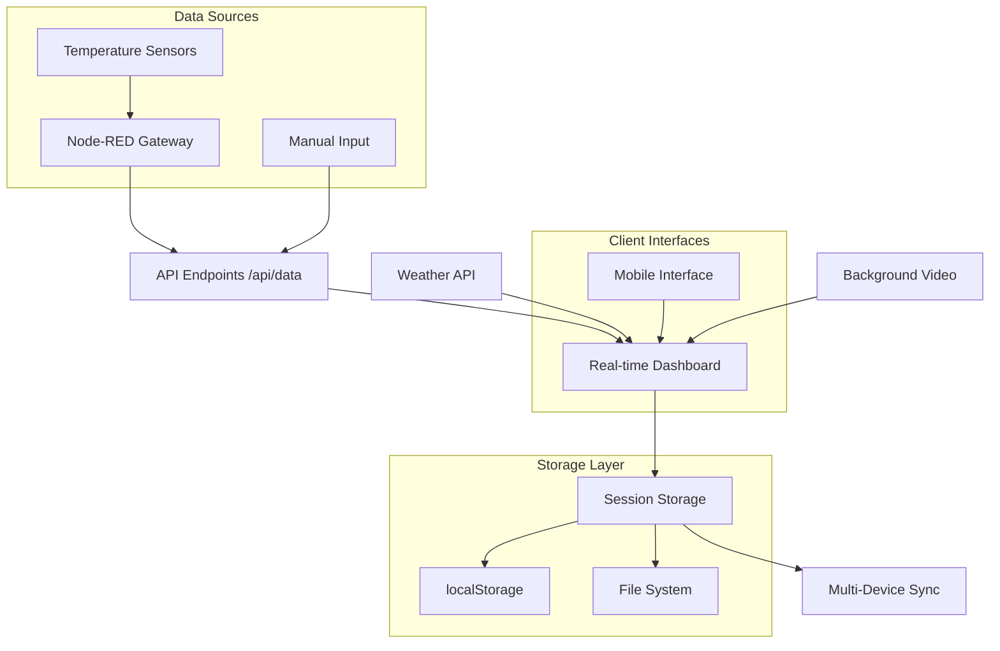

<div align="center">
  <h1>🥩 Meatify</h1>
  <p><strong>Professional BBQ & Grill Temperature Monitoring System</strong></p>
  
  [](https://nextjs.org/)
  [](https://www.typescriptlang.org/)
  [](https://www.docker.com/)
  [](https://tailwindcss.com/)
  [](https://www.raspberrypi.org/)
  [](https://opensource.org/licenses/MIT)
  
  <p>A modern, real-time temperature monitoring solution for BBQ enthusiasts and professional pitmasters</p>
  <p><em>Built for multi-device synchronization with Node-RED integration and Raspberry Pi support</em></p>
</div>

---

## ✨ Features

### 🌡️ **Advanced Temperature Monitoring**
- **Real-time tracking** of up to 7 temperature sensors (2 ambient/grill + 5 meat probes)
- **Dual temperature units** (Celsius/Fahrenheit) with instant conversion
- **Historical temperature charts** with customizable time ranges and persistent storage
- **Intelligent alerting** for overcooking and target temperature achievement
- **Auto-session detection** when grill reaches cooking temperatures
- **Node-RED integration** with automatic fallback to manual data input

### 🥩 **Smart Meat Management**
- **Visual meat selector** with high-quality food photography
- **Pre-configured temperature targets** for 9 different meat types:
  - **Beef**: Brisket, Ribs, Tenderloin
  - **Pork**: Shoulder, Ribs, Tenderloin  
  - **Chicken**: Breast, Thigh
  - **Lamb**: Chops
- **Cooking progress tracking** with estimated completion times
- **Status indicators**: Cooking → Almost Done → Done
- **Custom temperature targets** with per-sensor configuration

### 📱 **Multi-Device Session Management**
- **Persistent sessions** with automatic 24-hour retention and cleanup
- **Cross-device synchronization** via hybrid localStorage + file-based storage
- **Real-time conflict resolution** for concurrent device usage
- **Session restore** for interrupted cooking sessions with automatic detection
- **Multi-device sync** every 30 seconds across all connected devices
- **Device identification** and timestamp-based merging

### 🌤️ **Weather Integration**
- **Live weather data** for Hallein, Salzburg, Austria (Open-Meteo API)
- **12-hour forecast** with precipitation probability and weather codes
- **Wind speed and temperature** metrics for outdoor cooking conditions
- **Weather-aware cooking** recommendations and alerts

### 📊 **Professional Dashboard**
- **Responsive design** optimized for mobile and desktop
- **Mobile-optimized interface** with intuitive tab-based navigation
- **Live highlights panel** showing cooking progress and real-time alerts
- **Interactive temperature charts** with target line indicators and zoom
- **Real-time session timer** with elapsed cooking time
- **Background video** for enhanced visual experience
- **Debug window** with Node-RED connection status and data source indicators

### 🔌 **Hardware Integration**
- **Node-RED compatibility** for professional sensor setups
- **Automatic data source switching** (Node-RED → Manual input)
- **RESTful API endpoints** for sensor data integration
- **Health monitoring** with Docker container health checks
- **Raspberry Pi optimization** with ARM64 support

### 📱 **Multi-Device Session Management**
- **Persistent sessions** with automatic 24-hour retention and cleanup
- **Cross-device synchronization** via hybrid localStorage + file-based storage
- **Real-time conflict resolution** for concurrent device usage
- **Session restore** for interrupted cooking sessions with automatic detection
- **Multi-device sync** every 30 seconds across all connected devices
- **Device identification** and timestamp-based merging

### 🌤️ **Weather Integration**
- **Live weather data** for Hallein, Salzburg, Austria (Open-Meteo API)
- **12-hour forecast** with precipitation probability and weather codes
- **Wind speed and temperature** metrics for outdoor cooking conditions
- **Weather-aware cooking** recommendations and alerts

### 📊 **Professional Dashboard**
- **Responsive design** optimized for mobile and desktop
- **Mobile-optimized interface** with intuitive tab-based navigation
- **Live highlights panel** showing cooking progress and real-time alerts
- **Interactive temperature charts** with target line indicators and zoom
- **Real-time session timer** with elapsed cooking time
- **Background video** for enhanced visual experience
- **Debug window** with Node-RED connection status and data source indicators

### 🔌 **Hardware Integration**
- **Node-RED compatibility** for professional sensor setups
- **Automatic data source switching** (Node-RED → Manual input)
- **RESTful API endpoints** for sensor data integration
- **Health monitoring** with Docker container health checks
- **Raspberry Pi optimization** with ARM64 support

## 🚀 Quick Start

### Prerequisites
- **Node.js** 20.x or higher
- **Docker** (recommended for production)
- **Git** for version control

### Development Environment
```bash
# Clone the repository
git clone https://github.com/YOUR_USERNAME/meatify.git
cd meatify

# Install dependencies
npm install

# Start development server with Turbopack
npm run dev

# Open your browser
open http://localhost:3000
```

### Production Deployment (Docker)
```bash
# Quick start with Docker Compose
docker-compose up -d

# For Raspberry Pi (ARM64)
docker-compose -f docker-compose.pi.yml up -d

# Access your monitoring dashboard
open http://localhost:3000
```

### Node-RED Integration
```bash
# Configure Node-RED endpoint (default: http://192.168.0.168:1880)
# The system automatically falls back to manual input if Node-RED is unavailable
# API endpoint: GET /sensors (returns Sensor[] array)
```

## 📸 Screenshots

<div align="center">
  
  <p><em>Professional desktop interface with real-time monitoring</em></p>
</div>

<div align="center">
  
  <p><em>Mobile-optimized dashboard with touch-friendly controls</em></p>
</div>

---

## 🏗️ Architecture

### System Overview


### Session Storage Strategy
- **🔄 Hybrid Persistence**: localStorage + file-based storage
- **📱 Client-Side**: Immediate persistence with localStorage
- **☁️ Server-Side**: Cross-device synchronization via `/app/data/sessions/`
- **🔒 Conflict Resolution**: Timestamp-based merging with device identification
- **🧹 Auto-Cleanup**: 24-hour session retention with automatic cleanup
- **📊 Backup System**: Session backups in `/app/data/backups/`

### Data Flow
```typescript
interface GrillSession {
  id: string                                       // Unique session identifier
  startTime: Date | null                          // Cooking start timestamp
  isActive: boolean                               // Active session flag
  selectedMeats: Record<number, MeatType | null>  // Per-sensor meat selection
  sensorTargets: Record<number, number>           // Custom temperature targets
  temperatureHistory: Record<number, TemperatureReading[]> // Persistent history with timestamps
  lastSaved: Date                                 // Last sync timestamp
}

interface TemperatureReading {
  temperature: number                             // Temperature value
  timestamp: Date                                 // Reading timestamp
}
```

### Node-RED Integration
```typescript
// Expected Node-RED API Response Format
interface Sensor {
  id: number                                      // Sensor identifier (0-6)
  currentTemp: number                             // Current temperature reading
  targetTemp: number                              // Target temperature
  history: number[]                               // Recent temperature history
}

// API Endpoint: GET http://192.168.0.168:1880/sensors
// Fallback: Manual sensor data via POST /api/data
```

## ⚙️ Configuration

### Environment Variables
```bash
# Node-RED Integration (optional)
NODE_RED_URL=http://192.168.0.168:1880

# API Configuration
NEXT_PUBLIC_API_BASE_URL=http://localhost:3000

# Production Optimizations
NODE_ENV=production
PORT=3000
NEXT_TELEMETRY_DISABLED=1
```

### Session Configuration
| Setting | Value | Description |
|---------|-------|-------------|
| **Session Retention** | 24 hours | Automatic session cleanup |
| **History Limit** | Unlimited with timestamps | Persistent temperature history |
| **Sync Interval** | 30 seconds | Multi-device synchronization |
| **Auto-start Threshold** | Grill: 30°C, Meat: 10°C | Automatic session detection |
| **Weather Update** | Every page load | Live weather data refresh |
| **Data Source Priority** | Node-RED → Manual | Automatic fallback system |

### Docker Configuration
```yaml
# docker-compose.yml highlights
version: '3.8'
services:
  meatify:
    image: meatify-app:latest
    ports:
      - "3000:3000"
    volumes:
      - ./data:/app/data          # Persistent session storage
    environment:
      - NODE_ENV=production
      - PORT=3000
    restart: unless-stopped
    healthcheck:
      test: ["CMD", "curl", "-f", "http://localhost:3000/api/health"]
      interval: 30s
      timeout: 10s
      retries: 3
      start_period: 40s
```

### Raspberry Pi Configuration
```yaml
# docker-compose.pi.yml for ARM64
version: '3.8'
services:
  meatify:
    build:
      context: .
      dockerfile: Dockerfile
      platforms:
        - linux/arm64
    container_name: meatify-pi
    volumes:
      - meatify_data:/app/data    # Named volume for persistence
    environment:
      - NODE_ENV=production
```

## 🛠️ Development

### Tech Stack
- **⚡ Framework**: Next.js 15.2.4 with App Router and Turbopack
- **🔷 Language**: TypeScript 5.0 for comprehensive type safety
- **🎨 Styling**: Tailwind CSS 4.0 with custom animations and tw-animate-css
- **📊 Charts**: Chart.js + React Chart.js 2 for temperature visualization
- **🏗️ Components**: Radix UI primitives for accessibility
- **🐳 Deployment**: Multi-stage Docker builds with ARM64 support
- **☁️ Weather**: Open-Meteo API for live weather data
- **🔌 Integration**: Node-RED compatible API endpoints

### Project Structure
```
meatify/
├── app/                     # Next.js App Router
│   ├── api/                # API endpoints
│   │   ├── data/          # Sensor data endpoint (Node-RED integration)
│   │   ├── health/        # Health check for Docker
│   │   └── session/       # Session management API
│   ├── dashboard/         # Alternative dashboard view
│   ├── grill/            # Main grill monitoring interface
│   ├── test-video/       # Video background testing
│   ├── layout.tsx        # Root layout with storage initialization
│   └── page.tsx          # Home page (redirects to /grill)
├── components/            # React components
│   ├── ui/               # Base UI components (Radix UI)
│   ├── grill-monitor.tsx # Main dashboard component
│   ├── mobile-dashboard.tsx # Mobile-optimized interface
│   ├── meat-sensor-card.tsx # Individual meat probe cards
│   ├── ambient-sensor-card.tsx # Grill temperature cards
│   ├── weather-widget.tsx # Weather integration
│   ├── temperature-chart.tsx # Chart.js integration
│   ├── sync-status.tsx   # Multi-device sync status
│   ├── debug-window.tsx  # Development debugging
│   └── background-video.tsx # Video background
├── lib/                   # Core business logic
│   ├── api.ts            # Sensor data fetching
│   ├── dataStore.ts      # Session persistence & sync
│   ├── historyUtils.ts   # Temperature history management
│   ├── useSession.ts     # Session React hook
│   ├── types.ts          # TypeScript interfaces
│   ├── utils.ts          # Utility functions
│   └── weather-api.ts    # Weather API integration
├── public/               # Static assets
│   ├── images/          # Meat type photography (9 types)
│   └── videos/          # Background video (fire.mp4)
├── data/                # Persistent storage
│   ├── sessions/        # Session files (current.json)
│   └── backups/         # Session backups
├── Dockerfile           # Standard Docker build
├── Dockerfile.pi        # ARM64/Raspberry Pi optimized
├── docker-compose.yml   # Standard deployment
├── docker-compose.pi.yml # Raspberry Pi deployment
└── components.json      # Radix UI configuration
```

### API Endpoints

| Endpoint | Method | Description | Integration |
|----------|--------|-------------|-------------|
| `/api/data` | GET | Fetch current sensor readings | Node-RED primary, manual fallback |
| `/api/data` | POST | Submit manual sensor data | Manual input when Node-RED unavailable |
| `/api/session` | GET | Load current session | Multi-device synchronization |
| `/api/session` | POST | Save session data | Cross-device session sharing |
| `/api/health` | GET | Health check | Docker container monitoring |

### Node-RED Integration
```javascript
// Expected Node-RED flow endpoint
// GET http://192.168.0.168:1880/sensors
[
  {
    "id": 0,
    "currentTemp": 225.5,
    "targetTemp": 225,
    "history": [220, 222, 224, 225]
  },
  // ... sensors 1-6
]
```

### Local Development
```bash
# Install dependencies
npm install

# Start development server with Turbopack
npm run dev

# Run linting
npm run lint

# Build for production
npm run build
npm start

# Docker development
docker build -t meatify-dev .
docker run -p 3000:3000 -v $(pwd)/data:/app/data meatify-dev

# Raspberry Pi testing
docker build -f Dockerfile.pi -t meatify-pi .
```

## 🚀 Deployment Options

### 🐳 Docker (Recommended)
Perfect for multi-device synchronization and persistent sessions.

```bash
# Standard deployment with Docker Compose
git clone https://github.com/YOUR_USERNAME/meatify.git
cd meatify
docker-compose up -d

# Raspberry Pi deployment (ARM64 optimized)
docker-compose -f docker-compose.pi.yml up -d

# Manual Docker deployment
docker build -t meatify .
docker run -d \
  -p 3000:3000 \
  -v $(pwd)/data:/app/data \
  --name meatify-grill \
  --restart unless-stopped \
  --health-cmd="curl -f http://localhost:3000/api/health || exit 1" \
  --health-interval=30s \
  --health-retries=3 \
  meatify

# Check deployment status
docker ps
docker logs meatify-grill
```

### 🍓 Raspberry Pi Deployment
Optimized for ARM64 with persistent storage.

```bash
# Clone on Raspberry Pi
git clone https://github.com/YOUR_USERNAME/meatify.git
cd meatify

# Build ARM64 image
docker build -f Dockerfile.pi -t meatify-pi .

# Deploy with named volume
docker-compose -f docker-compose.pi.yml up -d

# Monitor performance
docker stats meatify-pi
```

### ☁️ Cloud Platforms
Deploy to any Node.js hosting platform:

```bash
# Vercel (recommended for development/testing)
npm install -g vercel
vercel

# Railway
npm install -g @railway/cli
railway login
railway deploy

# DigitalOcean App Platform
doctl apps create --spec .do/app.yaml

# Render
# Connect GitHub repository via Render dashboard
# Build Command: npm run build
# Start Command: npm start
```

> **⚠️ Important**: File-based session sharing requires persistent storage. Cloud deployments will use localStorage only unless you configure external storage.

### 🏠 Self-Hosted Production
Ideal for dedicated BBQ setups and professional kitchens:

```bash
# Production server setup
git clone https://github.com/YOUR_USERNAME/meatify.git
cd meatify

# Environment configuration
cat > .env.local << EOF
NODE_ENV=production
PORT=3000
NODE_RED_URL=http://YOUR_NODE_RED_IP:1880
NEXT_TELEMETRY_DISABLED=1
EOF

# SSL with reverse proxy (nginx example)
cat > /etc/nginx/sites-available/meatify << EOF
server {
    listen 443 ssl;
    server_name your-domain.com;
    
    ssl_certificate /path/to/ssl/cert.pem;
    ssl_certificate_key /path/to/ssl/private.key;
    
    location / {
        proxy_pass http://localhost:3000;
        proxy_set_header Host \$host;
        proxy_set_header X-Real-IP \$remote_addr;
        proxy_set_header X-Forwarded-For \$proxy_add_x_forwarded_for;
        proxy_set_header X-Forwarded-Proto \$scheme;
    }
}
EOF

# Start with Docker Compose
docker-compose up -d

# Access from network devices
# https://your-domain.com or http://YOUR_SERVER_IP:3000
```

### 🔧 Hardware Integration Setup

#### Node-RED Configuration
```bash
# Install Node-RED (if not already installed)
npm install -g --unsafe-perm node-red

# Start Node-RED
node-red

# Configure sensor flow to expose endpoint:
# GET http://YOUR_NODE_RED_IP:1880/sensors
# Response format: Array<{id: number, currentTemp: number, targetTemp: number, history: number[]}>
```

#### Temperature Sensor Integration
- **Compatible with**: Dallas DS18B20, thermocouples, RTD sensors
- **Connection**: Via Node-RED GPIO pins or USB interfaces
- **Frequency**: Real-time updates (recommended 1-5 second intervals)
- **Fallback**: Manual temperature input when hardware unavailable

```bash
# On Raspberry Pi or home server
git clone <repository-url>
cd meatify

# Build and run
docker-compose up -d

# Access from any device on your network
# http://YOUR_SERVER_IP:3000
```

## 🔧 Hardware Integration

### Supported Temperature Sensors
- **Sensor Count**: Up to 7 sensors (2 grill + 5 meat probes)
- **Temperature Range**: -40°C to 300°C
- **API Format**: REST endpoints returning JSON sensor data

### Sensor Data Format
```typescript
interface Sensor {
  id: number              // 0-1: grill sensors, 2-6: meat sensors
  currentTemp: number     // Current temperature in Celsius
  targetTemp: number      // Target temperature in Celsius
  history: number[]       // Last 100 temperature readings
}
```

## 🤝 Contributing

We welcome contributions! Please see our [Contributing Guidelines](CONTRIBUTING.md).

### Development Setup
```bash
# Fork and clone the repository
git clone https://github.com/YOUR_USERNAME/meatify.git
cd meatify

# Install dependencies
npm install

# Create a feature branch
git checkout -b feature/amazing-feature

# Start development server
npm run dev
```

#### Temperature Sensor Integration
- **Compatible with**: Dallas DS18B20, thermocouples, RTD sensors
- **Connection**: Via Node-RED GPIO pins or USB interfaces
- **Frequency**: Real-time updates (recommended 1-5 second intervals)
- **Fallback**: Manual temperature input when hardware unavailable

---

## 📱 Mobile Experience

### Responsive Design Features
- **Touch-optimized interface** with swipe navigation
- **Tab-based mobile layout** (Overview, History, Live Highlights, Weather, Debug)
- **Expandable sensor cards** for detailed view
- **Portrait and landscape** orientation support
- **PWA capabilities** for app-like experience
- **Offline resilience** with localStorage caching

### Mobile-Specific Components
- **MobileDashboard**: Dedicated mobile interface
- **Touch-friendly controls** for temperature adjustment
- **Swipe gestures** for navigation
- **Optimized charts** for small screens
- **Auto-rotation** temperature units display

---

## 🎯 Use Cases

### 🏠 Home BBQ Enthusiasts
- **Weekend grilling sessions** with automatic session management
- **Multi-device monitoring** (phone, tablet, laptop)
- **Weather-aware cooking** with local forecast integration
- **Historical tracking** of favorite recipes and cooking times

### 👨‍🍳 Professional Pitmasters
- **Commercial smoker monitoring** with multiple probe support
- **24/7 session persistence** for long smoking sessions
- **Node-RED integration** for professional sensor arrays
- **Raspberry Pi deployment** for dedicated monitoring stations

### 🏭 Restaurant Kitchens
- **Food safety compliance** with temperature logging
- **Multi-station monitoring** across different cooking areas
- **Session backup system** for audit trails
- **Health monitoring** with Docker container management

### 🔬 Food Scientists & Researchers
- **Precise temperature logging** with timestamp data
- **Data export capabilities** for analysis
- **API integration** for laboratory equipment
- **Historical data retention** for research studies

---

## 🔧 Troubleshooting

### Common Issues

#### Node-RED Connection Problems
```bash
# Check Node-RED status
curl http://192.168.0.168:1880/sensors

# Debug API endpoint
curl http://localhost:3000/api/data

# View container logs
docker logs meatify-grill

# Check network connectivity
ping 192.168.0.168
```

#### Session Sync Issues
```bash
# Check data directory permissions
ls -la data/sessions/

# Verify session file
cat data/sessions/current.json

# Clear corrupted session
rm data/sessions/current.json
```

#### Docker Deployment Issues
```bash
# Check container health
docker ps
docker inspect meatify-grill

# Rebuild image
docker-compose down
docker-compose build --no-cache
docker-compose up -d

# Check logs
docker-compose logs -f meatify
```

### Performance Optimization

#### For Raspberry Pi
- Use `docker-compose.pi.yml` for ARM64 optimization
- Monitor CPU usage: `htop`
- Ensure adequate cooling for continuous operation
- Use quality SD card (Class 10 or better)

#### For Multi-Device Sync
- Increase sync interval if network is slow
- Check firewall settings for port 3000
- Use wired connection for primary device
- Monitor session file size growth

---

## 🤝 Contributing

We welcome contributions! Please see our [Contributing Guidelines](CONTRIBUTING.md) for detailed information.

### Quick Start for Contributors
```bash
# Fork and clone the repository
git clone https://github.com/YOUR_USERNAME/meatify.git
cd meatify

# Install dependencies
npm install

# Create a feature branch
git checkout -b feature/amazing-feature

# Start development server
npm run dev

# Run linting
npm run lint

# Commit your changes (use conventional commits)
git commit -m "feat(sensors): add support for 8th temperature probe"

# Push and create PR
git push origin feature/amazing-feature
```

### Development Workflow
- **Code Style**: ESLint + TypeScript strict mode
- **Commits**: Follow [Conventional Commits](https://www.conventionalcommits.org/)
- **Testing**: Manual testing with Docker builds
- **Documentation**: Update README for new features

### Areas We Need Help With
- 🔌 **Hardware Integration**: Additional sensor types and protocols
- 📱 **Mobile Optimization**: iOS/Android specific improvements
- 🌍 **Internationalization**: Multi-language support
- 📊 **Data Export**: CSV/JSON export functionality
- 🧪 **Testing**: Unit tests and integration tests
- 📚 **Documentation**: User guides and API documentation
- ⚡ **Performance**: Optimization for resource-constrained devices

---

## 📄 License

This project is licensed under the **MIT License** - see the [LICENSE](LICENSE) file for details.

### Key Points
- ✅ **Commercial use** allowed
- ✅ **Modification** and **distribution** permitted
- ✅ **Private use** encouraged
- ❗ **No warranty** provided
- ❗ **Attribution** required

---

## 🙏 Acknowledgments

- **Next.js Team** for the amazing React framework
- **Radix UI** for accessible component primitives
- **Chart.js** for beautiful temperature visualizations
- **Tailwind CSS** for rapid UI development
- **Open-Meteo** for free weather API access
- **BBQ Community** for inspiration and feedback

---

## 📞 Support & Contact

### Getting Help
- 📖 **Documentation**: Check this README and [Contributing Guidelines](CONTRIBUTING.md)
- 🐛 **Bug Reports**: [Create an issue](https://github.com/YOUR_USERNAME/meatify/issues)
- 💡 **Feature Requests**: [Start a discussion](https://github.com/YOUR_USERNAME/meatify/discussions)
- ❓ **Questions**: [GitHub Discussions](https://github.com/YOUR_USERNAME/meatify/discussions)

### Project Status
- 🚀 **Active Development**: Regular updates and improvements
- 🔄 **Version**: 0.1.0 (Initial Release)
- 📅 **Last Updated**: June 2025
- 🌟 **Roadmap**: Multi-language support, advanced analytics, mobile app

---

<div align="center">
  <h2>🔥 Happy Grilling! 🥩</h2>
  <p><strong>Built with ❤️ for BBQ enthusiasts worldwide</strong></p>
  <p><em>Perfect steaks, every time</em></p>
  
  <br>
  
  <a href="https://github.com/YOUR_USERNAME/meatify/stargazers">⭐ Star this project</a> •
  <a href="https://github.com/YOUR_USERNAME/meatify/fork">🍴 Fork it</a> •
  <a href="https://github.com/YOUR_USERNAME/meatify/issues">🐛 Report bug</a> •
  <a href="https://github.com/YOUR_USERNAME/meatify/discussions">💬 Discuss</a>
</div>
