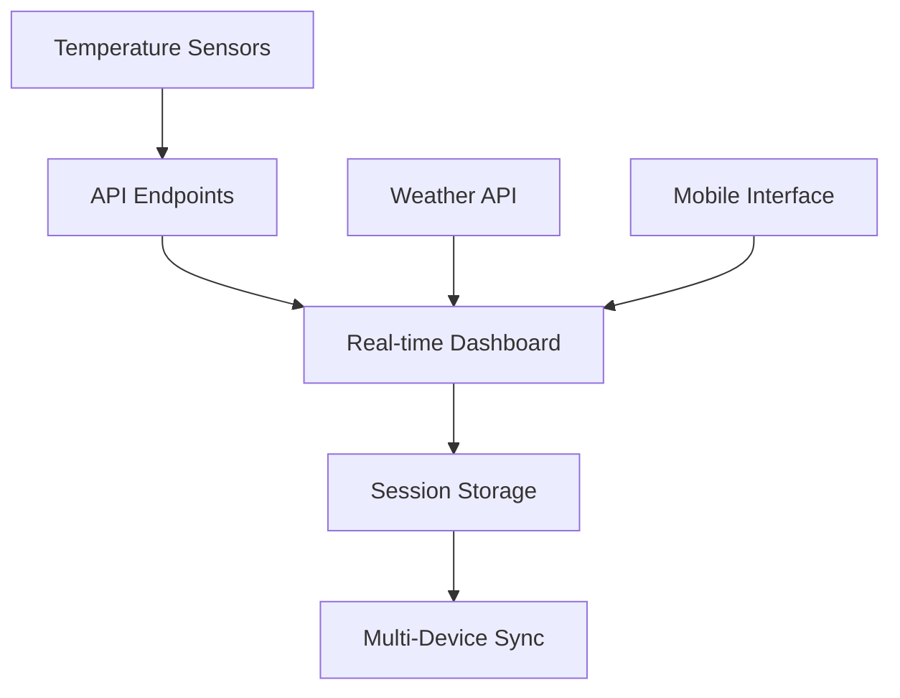

<div align="center">
  <h1>🥩 Meatify</h1>
  <p><strong>Professional BBQ & Grill Temperature Monitoring System</strong></p>
  
  [](https://nextjs.org/)
  [](https://www.typescriptlang.org/)
  [](https://www.docker.com/)
  [](https://tailwindcss.com/)
  
  <p>A modern, real-time temperature monitoring solution for BBQ enthusiasts and professional pitmasters</p>
</div>

---

## ✨ Features

### 🌡️ **Advanced Temperature Monitoring**
- **Real-time tracking** of up to 7 temperature sensors (2 grill + 5 meat probes)
- **Dual temperature units** (Celsius/Fahrenheit) with instant conversion
- **Historical temperature charts** with customizable time ranges
- **Intelligent alerting** for overcooking and target temperature achievement
- **Auto-session detection** when grill reaches cooking temperatures

### 🥩 **Smart Meat Management**
- **Visual meat selector** with high-quality food photography
- **Pre-configured temperature targets** for 9 different meat types:
  - Beef: Brisket, Ribs, Tenderloin
  - Pork: Shoulder, Ribs, Tenderloin  
  - Chicken: Breast, Thigh
  - Lamb: Chops
- **Cooking progress tracking** with estimated completion times
- **Status indicators**: Cooking → Almost Done → Done

### 📱 **Multi-Device Session Management**
- **Persistent sessions** with automatic 24-hour retention
- **Cross-device synchronization** via file-based storage
- **Session restore** for interrupted cooking sessions
- **Intelligent conflict resolution** for concurrent device usage
- **Real-time data sync** every 5 seconds across all connected devices

### 🌤️ **Weather Integration**
- **Live weather data** for Hallein, Salzburg, Austria
- **6-hour forecast** with precipitation probability
- **Wind, humidity, and visibility** metrics
- **Weather-aware cooking** recommendations

### 📊 **Professional Dashboard**
- **Responsive design** optimized for mobile and desktop
- **Live highlights panel** showing cooking progress and alerts
- **Interactive temperature charts** with target line indicators
- **Mobile-optimized interface** with tab-based navigation
- **Real-time session timer** with elapsed cooking time

## 🚀 Quick Start

### Development Environment
```bash
# Clone and install dependencies
git clone <repository-url>
cd meatify
npm install

# Start development server with Turbopack
npm run dev
```

### Production Deployment (Docker)
```bash
# Quick start with Docker Compose
docker-compose up -d

# Access your monitoring dashboard
open http://localhost:3000
```

## 📸 Screenshots

<div align="center">
  
  <p><em>Professional desktop interface with real-time monitoring</em></p>
</div>

<div align="center">
  
  <p><em>Mobile-optimized dashboard with touch-friendly controls</em></p>
</div>

---

## 🏗️ Architecture

### System Overview


### Session Storage Strategy
- **🔄 Hybrid Persistence**: localStorage + file-based storage
- **📱 Client-Side**: Immediate persistence with localStorage
- **☁️ Server-Side**: Cross-device synchronization via `/app/data/sessions/`
- **🔒 Conflict Resolution**: Timestamp-based merging with device identification

### Data Flow
```typescript
interface GrillSession {
  id: string                                    // Unique session identifier
  startTime: Date | null                        // Cooking start timestamp
  isActive: boolean                            // Active session flag
  selectedMeats: Record<number, MeatType | null> // Per-sensor meat selection
  sensorTargets: Record<number, number>         // Custom temperature targets
  temperatureHistory: Record<number, number[]>  // Historical readings (100 limit)
  lastSaved: Date                              // Last sync timestamp
}
```

## ⚙️ Configuration

### Environment Variables
```bash
# Optional: Custom API endpoints
NEXT_PUBLIC_API_BASE_URL=http://localhost:3000

# Production optimizations
NODE_ENV=production
PORT=3000
```

### Session Settings
| Setting | Value | Description |
|---------|-------|-------------|
| **Session Retention** | 24 hours | Automatic session cleanup |
| **History Limit** | 100 readings | Per-sensor temperature history |
| **Sync Interval** | 5 seconds | Multi-device synchronization |
| **Auto-start Threshold** | Grill: 30°C, Meat: 10°C | Automatic session detection |

### Docker Configuration
```yaml
# docker-compose.yml highlights
services:
  meatify:
    volumes:
      - ./data:/app/data          # Persistent session storage
    environment:
      - NODE_ENV=production
    healthcheck:
      test: ["CMD", "curl", "-f", "http://localhost:3000/api/health"]
      interval: 30s
```

## 🛠️ Development

### Tech Stack
- **⚡ Framework**: Next.js 15.2.4 with App Router
- **🔷 Language**: TypeScript 5.0 for type safety
- **🎨 Styling**: Tailwind CSS 4.0 with custom animations
- **📊 Charts**: Chart.js + React Chart.js 2
- **🏗️ Components**: Radix UI primitives
- **🐳 Deployment**: Docker with multi-stage builds

### Project Structure
```
meatify/
├── app/                    # Next.js App Router pages
│   ├── api/               # API endpoints (/data, /health)
│   ├── dashboard/         # Dashboard page
│   └── grill/            # Main grill monitoring interface
├── components/            # React components
│   ├── ui/               # Base UI components (Radix UI)
│   ├── grill-monitor.tsx # Main dashboard component
│   ├── meat-sensor-card.tsx
│   ├── ambient-sensor-card.tsx
│   ├── weather-widget.tsx
│   └── mobile-dashboard.tsx
├── lib/                   # Utilities and data management
│   ├── api.ts            # Sensor data fetching
│   ├── dataStore.ts      # Session persistence
│   ├── types.ts          # TypeScript interfaces
│   └── weather-api.ts    # Weather integration
├── public/images/         # Meat type photography
└── data/                 # Persistent session storage
```

### API Endpoints

| Endpoint | Method | Description |
|----------|--------|-------------|
| `/api/data` | GET | Fetch current sensor readings |
| `/api/health` | GET | Health check for Docker containers |

### Local Development
```bash
# Install dependencies
npm install

# Start development server with Turbopack
npm run dev

# Run linting
npm run lint

# Build for production
npm run build
npm start
```

## 🚀 Deployment Options

### 🐳 Docker (Recommended)
Perfect for multi-device synchronization and persistent sessions.

```bash
# Using Docker Compose (recommended)
git clone <repository-url>
cd meatify
docker-compose up -d

# Manual Docker deployment
docker build -t meatify .
docker run -d \
  -p 3000:3000 \
  -v $(pwd)/data:/app/data \
  --name meatify-grill \
  --restart unless-stopped \
  meatify
```

### ☁️ Cloud Platforms
Deploy to any Node.js hosting platform:

```bash
# Vercel (recommended for development)
npx vercel

# Railway
railway deploy

# DigitalOcean App Platform
doctl apps create --spec .do/app.yaml
```

> **Note**: File-based session sharing requires persistent storage. Cloud deployments will use localStorage only.

### 🏠 Self-Hosted
Ideal for dedicated BBQ setups:

```bash
# On Raspberry Pi or home server
git clone <repository-url>
cd meatify

# Build and run
docker-compose up -d

# Access from any device on your network
# http://YOUR_SERVER_IP:3000
```

## 🔧 Hardware Integration

### Supported Temperature Sensors
- **Sensor Count**: Up to 7 sensors (2 grill + 5 meat probes)
- **Temperature Range**: -40°C to 300°C
- **API Format**: REST endpoints returning JSON sensor data

### Sensor Data Format
```typescript
interface Sensor {
  id: number              // 0-1: grill sensors, 2-6: meat sensors
  currentTemp: number     // Current temperature in Celsius
  targetTemp: number      // Target temperature in Celsius
  history: number[]       // Last 100 temperature readings
}
```

## 🤝 Contributing

We welcome contributions! Please see our [Contributing Guidelines](CONTRIBUTING.md).

### Development Setup
```bash
# Fork and clone the repository
git clone https://github.com/YOUR_USERNAME/meatify.git
cd meatify

# Install dependencies
npm install

# Create a feature branch
git checkout -b feature/amazing-feature

# Start development server
npm run dev
```

### Code Style
- **ESLint**: `npm run lint`
- **TypeScript**: Strict mode enabled
- **Prettier**: Auto-formatting on save
- **Commits**: Conventional commit format

## 📝 License

This project is licensed under the MIT License - see the [LICENSE](LICENSE) file for details.

---

<div align="center">
  <p><strong>Happy Grilling! 🔥🥩</strong></p>
  <p>Built with ❤️ for BBQ enthusiasts</p>
</div>
